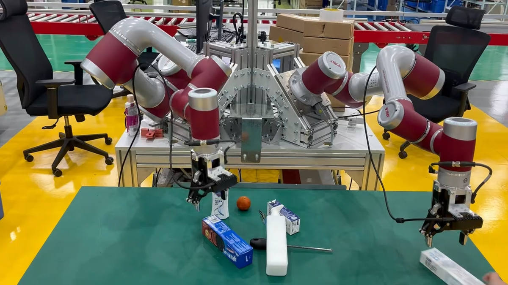
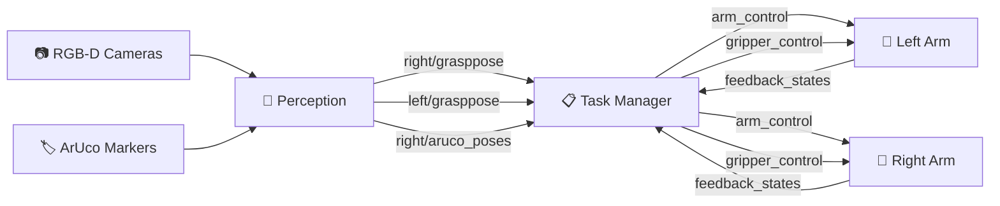

# 🤖 Dual-Arm Box Opening and Grasping System

> **A ROS 2-based autonomous dual-arm manipulation stack for intelligent box handling, object sorting, and intelligent task planning**


This repository contains a production-ready ROS 2 manipulation stack for real robot systems that autonomously opens boxes, detects objects, and sorts contents. It integrates **RGB-D perception**, **ArUco pose estimation**, **box keypoint detection**, **planar grasping**, and **dual-arm task orchestration** into a cohesive system.

---

## 🎬 Hardware Demo

<p align="center">
  <a href="docs/media/robot_arms_1.mp4">
    
  </a>
</p>

<p align="center">
  <a href="docs/media/robot_arms_1.mp4">
    <strong>▶️ Watch the live dual-arm coordination demo</strong>
  </a>
</p>

| Asset | Description | Size |
|-------|-------------|------|
| [`robot_arms_1.mp4`](docs/media/robot_arms_1.mp4) | Real dual-arm coordination for robotic sorting and box-handling workflow | 49 MiB |

---

## 🏗️ System Architecture

The system is organized into **four integrated layers**:

```
┌─────────────────────────────────────────────────────────────────┐
│                    PERCEPTION LAYER                             │
│  RGB-D streams → ArUco detection → Grounded segmentation       │
│  Mask/keypoint extraction → Grasp pose generation              │
└────────────────────────┬────────────────────────────────────────┘
                         │
┌────────────────────────▼────────────────────────────────────────┐
│                  TASK PLANNING LAYER                            │
│  Behavior trees & task-manager logic for:                       │
│  • Tool grasping • Tape cutting • Flap opening                 │
│  • Box flipping • Box lifting • Content sorting                │
└────────────────────────┬────────────────────────────────────────┘
                         │
┌────────────────────────▼────────────────────────────────────────┐
│                 MOTION EXECUTION LAYER                          │
│  ROS 2 actions for arm trajectories, TCP motion,               │
│  gripper commands, and real-time feedback                      │
└────────────────────────┬───────────────────────────��────────────┘
                         │
┌────────────────────────▼────────────────────────────────────────┐
│                 DEPLOYMENT LAYER                                │
│  Edge compute setup, ROS 2 Humble, MoveIt2,                    │
│  camera calibration, and robot connection                      │
└─────────────────────────────────────────────────────────────────┘
```

### Data Flow Diagram



---

## 📁 Repository Structure

```
Dual-Arm-Robotic-Sorting-System/
├── src/vision/                           # Python perception nodes
│   ├── aruco_pose_node.py               # Tool pose detection
│   ├── box_opening_keypoint_node.py     # Box handle detection
│   └── planar_depth_grasp_node.py       # Object grasp planning
│
├── ros2_ws/src/                         # ROS 2 workspace
│   ├── grasp_common/                    # Shared utilities
│   ├── grasp_interfaces/                # Custom ROS messages/actions
│   ├── grasp_task_manager/              # Main orchestration (C++)
│   └── jaka_controller/                 # Arm & gripper control
│
├── experiments/behavior_tree/           # Task planning prototypes
│   ├── config/                          # Behavior tree configs
│   ├── launch/                          # Launch files
│   ├── test_behavior/                   # Behavior tests
│   └── legacy/                          # Archive
│
├── docs/                                # Documentation
│   ├── deployment/                      # Setup guides
│   ├── media/                           # Videos & images
│   ├── workflow/                        # Process documentation
│   └── architecture/                    # Design docs
│
└── archives/                            # Legacy code
```

See [`docs/PROJECT_STRUCTURE.md`](docs/PROJECT_STRUCTURE.md) for detailed layout rationale.

---

## 🔧 Main Components

| Component | Location | Inputs | Outputs | Role |
|-----------|----------|--------|---------|------|
| **ArUco Pose Node** | `src/vision/aruco_pose_node.py` | RGB image + camera info | Tool/object poses | Marker detection & localization |
| **Box Keypoint Node** | `src/vision/box_opening_keypoint_node.py` | RGB-D image + camera info | Box grasp poses | Handle detection via segmentation |
| **Planar Grasp Node** | `src/vision/planar_depth_grasp_node.py` | RGB-D image + camera info | Grasp pose/width/depth | Depth-based object grasping |
| **Robot Controller** | `ros2_ws/src/jaka_controller` | ROS 2 action goals | Joint/TCP feedback | Robot SDK bridge |
| **Task Manager** | `ros2_ws/src/grasp_task_manager` | Perception + feedback | Arm/gripper actions | Workflow orchestration |
| **Behavior Tree** | `experiments/behavior_tree` | Config files + topics | ROS 2 actions | Policy prototyping |

---

## 📡 ROS 2 Interfaces

Custom action and message definitions in `ros2_ws/src/grasp_interfaces/grasp_msgs`:

| Interface | Type | Purpose |
|-----------|------|---------|
| `ArmControl.action` | Action | Joint, TCP line, or TCP circle commands |
| `GripperControl.action` | Action | Gripper position & force control |
| `DualGrasp.action` | Action | Coordinated dual-arm behavior |
| `ArmCommand.msg` | Message | Command encoding (JOINT/TCP/CIRCLE) |
| `FeedBackMsg.msg` | Message | Execution state, joint/TCP feedback |
| `KnifePose.msg` | Message | Tool pose estimates |
| `GraspPose.msg` / `DecisionPose.msg` | Message | Geometry & task decisions |

---

## 🖥️ Environment & Requirements

| Requirement | Specification |
|-------------|----------------|
| **OS** | Ubuntu 22.04 LTS (20.04 supported with caveats) |
| **ROS** | ROS 2 Humble |
| **Motion Stack** | MoveIt2 Humble + KDL |
| **Python** | 3.10+ |
| **Key Libraries** | PyTorch, OpenCV, GroundingDINO, Segment Anything, Open3D |
| **Hardware** | Dual robotic arms, RGB-D cameras, grippers |

---

## 🚀 Quick Start

### 1️⃣ Build the ROS 2 Workspace

```bash
cd ros2_ws
source /opt/ros/humble/setup.bash
rosdep install -r --from-paths src --ignore-src --rosdistro humble -y
colcon build --symlink-install
source install/setup.bash
```

### 2️⃣ Launch Dual-Arm Controller

```bash
source ros2_ws/install/setup.bash
ros2 launch jaka_controller dual_jaka_controller.launch.py
```

### 3️⃣ Launch Task Manager

```bash
source ros2_ws/install/setup.bash
ros2 launch grasp_task_manager grasp_task_manager.launch.py
```

### 4️⃣ Start Perception Nodes

**ArUco Detection:**
```bash
python3 src/vision/aruco_pose_node.py
```

**Box Keypoint Detection:**
```bash
python3 src/vision/box_opening_keypoint_node.py \
  --text_prompt box \
  --grounded_checkpoint /path/to/groundingdino_swint_ogc.pth \
  --sam_checkpoint /path/to/sam_vit_h_4b8939.pth
```

**Planar Depth Grasping:**
```bash
python3 src/vision/planar_depth_grasp_node.py \
  --network /path/to/c_d_epoch_36_iou_0.9943 \
  --use-depth 1 \
  --use-rgb 0 \
  --n-grasps 1
```

---

## ⚙️ Configuration

### Controller Parameters
Located in `ros2_ws/src/jaka_controller/params/`:
- `left_jaka_controller.yaml`
- `right_jaka_controller.yaml`
- `jaka_controller.yaml`

### Task & Calibration Data
Located in:
- `ros2_ws/src/grasp_task_manager/config/grasp_task_manager.yaml`
- `experiments/behavior_tree/test_behavior/real/*.txt`

### Critical Calibration Values

| Parameter | Meaning |
|-----------|---------|
| `tool2camera` | Camera pose relative to tool frame |
| `camerabase2top` | Transform between camera base and top frame |
| `tcp2tool` | Tool-center-point offset |
| `camera_intrinsic` | Camera intrinsic matrix |
| `init_joint` | Initial joint positions per arm |

---

## 📦 Box-Opening Workflow

The full autonomous sequence:

```
locate tool → grasp tool → locate box → cut tape → 
open flaps → place tool → flip box → lift box → sort contents
```

### Implementation Map

| Stage | Perception Source | Task-Manager Function |
|-------|-------------------|----------------------|
| Locate/grasp tool | ArUco pose node | `dispatchGraspKnifeTask` |
| Estimate object grasp | Planar depth node | `dispatchGraspObjectTask` |
| Move/place object | Fixed poses + computed | `moveToPlace`, `dispatchDropBoxTask` |
| Cut tape | Box keypoint node | `dispatchCutBoxTask`, `performCutBoxOperation` |
| Open flaps | TCP primitives | `dispatchOpenBoxTask`, `generateArmOpenCommandsForPose` |
| Place tool | Fixed pose | `dispatchPlaceKnifeTask` |
| Flip/lift box | Dual-arm grasp | `dispatchFlippBoxTask`, `dispatchLiftBoxTask` |
| Sort contents | 6D grasp prediction | `dispatchSortingObjectTask` |

---

## 🧠 Model & Data Paths

Large model checkpoints are **not** stored in this repository. Configure these locally:

| Model | Purpose | Typical File |
|-------|---------|--------------|
| **GroundingDINO SwinT** | Text-guided object detection | `groundingdino_swint_ogc.pth` |
| **SAM ViT-H** | Object mask prediction | `sam_vit_h_4b8939.pth` |
| **HRG / GG-CNN** | Planar depth grasping | `c_d_epoch_36_iou_0.9943` |
| **FGC-GraspNet** | 6D grasp prediction | `checkpoint_fgc.tar` |
| **box_centerline_utils** | Box geometry extraction | Local Python module |

Model paths are configurable via **command-line arguments** and **ROS parameters** without editing source.

---

## ⚠️ Safety Checklist

**Before deploying to hardware:**

- [ ] Confirm both robot IP addresses, namespaces, and initial joint poses
- [ ] Validate `init_joint` in simulation or low-speed manual mode
- [ ] Confirm camera intrinsics: `ros2 topic echo /left_camera/color/camera_info`
- [ ] Verify ArUco outputs in RViz before tool-grasp execution
- [ ] Validate `left/grasppose` and `right/grasppose` against camera frame
- [ ] Test gripper open/close with no objects in workspace
- [ ] Run arm motion at reduced speed with clear emergency stop access
- [ ] Execute full sequence only after all primitives pass individual tests

---

## 🎓 Reference Projects

This repository follows best practices from mature robotics projects:

- **[MoveIt2](https://github.com/moveit/moveit2)** — Motion planning, launch structure, descriptions
- **[ros2_control](https://github.com/ros-controls/ros2_control)** — Hardware abstraction patterns
- **[Navigation2](https://github.com/ros-navigation/navigation2)** — Behavior-tree task execution
- **[Grounded-Segment-Anything](https://github.com/IDEA-Research/Grounded-Segment-Anything)** — Language-guided segmentation
- **[GraspNet Baseline](https://github.com/graspnet/graspnet-baseline)** — 6D grasp detection pipeline
- **[FGC-GraspNet](https://github.com/ZhihaoDong/FGC-GraspNet)** — Advanced 6D grasping

---

## 📋 Known Follow-Up Work

- [ ] Replace hard-coded calibration with versioned calibration file
- [ ] Add launch files for standalone Python perception nodes
- [ ] Create small rosbag dataset for repeatable perception testing
- [ ] Split legacy scripts into stable vs. experimental
- [ ] Add CI/CD for Python linting, ROS generation, C++ formatting

---

## 📄 License & Attribution

[Add your license here]

---

## 💬 Contributing & Support

For questions, issues, or contributions, please [open an issue](https://github.com/yunruiguo/Dual-Arm-Robotic-Sorting-System/issues) or submit a pull request.

**⭐ If this project is helpful, please consider starring it!**
