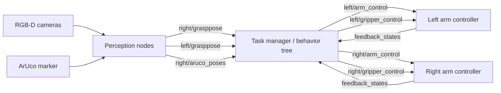

# Dual-Arm Box Opening and Grasping System

This repository contains a ROS 2 based dual-arm manipulation stack for a real robot system that performs a full box-opening workflow. It includes RGB-D perception, ArUco pose estimation, box keypoint extraction, planar grasp prediction, arm and gripper action control, task sequencing, deployment notes, and preserved legacy source bundles.

The project has been reorganized into a source-first layout so the active code, ROS 2 workspace, experiments, documentation, and archived legacy artifacts are easy to inspect and rebuild.

## System Overview

The system is organized around four layers:

1. Perception: RGB-D image subscription, ArUco detection, grounded segmentation, mask/keypoint extraction, and grasp pose generation.
2. Task planning: behavior-tree experiments and task-manager logic for grasping tools, cutting tape, opening flaps, flipping boxes, lifting boxes, and sorting objects.
3. Motion execution: ROS 2 action interfaces for arm trajectories, TCP line/circle motion, gripper commands, and feedback state publishing.
4. Deployment: documented setup for edge compute boards, ROS 2 Humble, MoveIt2, camera calibration, and robot connection parameters.



## Repository Layout

```text
.
├── src/vision/
│   ├── aruco_pose_node.py
│   ├── box_opening_keypoint_node.py
│   └── planar_depth_grasp_node.py
├── ros2_ws/src/
│   ├── grasp_common/grasp_util/
│   ├── grasp_interfaces/grasp_msgs/
│   ├── grasp_task_manager/
│   └── jaka_controller/
├── experiments/behavior_tree/
│   ├── config/
│   ├── launch/
│   ├── test_behavior/
│   └── legacy/
├── docs/
│   ├── deployment/
│   ├── workflow/
│   ├── architecture/
│   └── PROJECT_STRUCTURE.md
└── archives/
    └── legacy_robot_workspace.rar
```

`docs/PROJECT_STRUCTURE.md` records the file-renaming map and the rationale behind the current layout.

## Main Components

| Component | Node or package | Inputs | Outputs | Responsibility |
| --- | --- | --- | --- | --- |
| ArUco pose node | `src/vision/aruco_pose_node.py` | Right RGB image and camera info | `right/aruco_poses`, `aruco_markers` | Detect markers and publish tool/object reference poses. |
| Box keypoint node | `src/vision/box_opening_keypoint_node.py` | Right RGB-D image and camera info | `right/grasppose` | Use grounded segmentation and mask geometry to estimate box-opening keypoints. |
| Planar grasp node | `src/vision/planar_depth_grasp_node.py` | Left RGB-D image and camera info | `left/grasppose` | Run depth-image grasp detection and publish grasp pose, angle, width, and depth. |
| Robot controller | `ros2_ws/src/jaka_controller` | ROS 2 action goals | `feedback_states` | Bridge ROS 2 actions to the robot SDK and gripper control. |
| Task manager | `ros2_ws/src/grasp_task_manager` | Perception results and action feedback | Arm and gripper actions | Sequence the full box-opening task flow. |
| Experiments | `experiments/behavior_tree` | Config files and perception topics | ROS 2 action calls | Prototype behavior-tree and Python task-manager policies. |

## ROS 2 Interfaces

The custom action and message definitions live in `ros2_ws/src/grasp_interfaces/grasp_msgs`.

| Interface | Type | Purpose |
| --- | --- | --- |
| `ArmControl.action` | action | Executes one or more joint, TCP line, or TCP circle commands. |
| `GripperControl.action` | action | Sends gripper position and force commands. |
| `DualGrasp.action` | action | Coordinates dual-arm grasp behavior. |
| `ArmCommand.msg` | msg | Encodes `JOINT_TYPE`, `TCP_TYPE`, and `TCP_CIRCLE_TYPE` commands. |
| `FeedBackMsg.msg` | msg | Reports execution state, gripper state, joint position, and TCP pose. |
| `KnifePose.msg` | msg | Stores knife pose estimates. |
| `GraspPose.msg` / `DecisionPose.msg` | msg | Stores grasp candidate geometry and task decisions. |

## Environment

The expected deployment target is an edge compute board connected to two robot arms, two grippers, and RGB-D cameras.

| Area | Expected setup |
| --- | --- |
| Operating system | Ubuntu 22.04 is preferred. |
| ROS | ROS 2 Humble. |
| Motion stack | MoveIt2 Humble and KDL. |
| Python | Python 3.10 on Ubuntu 22.04. |
| Perception libraries | PyTorch, OpenCV, GroundingDINO, Segment Anything, Open3D, `graspnetAPI`, and `pyorbbecsdk`. |
| Model artifacts | Local model checkpoints for grounded segmentation, mask prediction, planar grasping, and 6D grasping. |

Some deployment notes also cover Ubuntu 20.04 based systems. Prefer the Ubuntu 22.04 path for a cleaner ROS 2 Humble and MoveIt2 setup.

## Quick Start

Build the ROS 2 workspace:

```bash
cd ros2_ws
source /opt/ros/humble/setup.bash
rosdep install -r --from-paths src --ignore-src --rosdistro humble -y
colcon build --symlink-install
source install/setup.bash
```

Launch the dual-arm controller:

```bash
source ros2_ws/install/setup.bash
ros2 launch jaka_controller dual_jaka_controller.launch.py
```

Launch the C++ task manager:

```bash
source ros2_ws/install/setup.bash
ros2 launch grasp_task_manager grasp_task_manager.launch.py
```

Run ArUco detection:

```bash
python3 src/vision/aruco_pose_node.py
```

Run box keypoint perception:

```bash
python3 src/vision/box_opening_keypoint_node.py \
  --text_prompt box \
  --grounded_checkpoint /path/to/groundingdino_swint_ogc.pth \
  --sam_checkpoint /path/to/sam_vit_h_4b8939.pth
```

Run planar depth grasping:

```bash
python3 src/vision/planar_depth_grasp_node.py \
  --network /path/to/c_d_epoch_36_iou_0.9943 \
  --use-depth 1 \
  --use-rgb 0 \
  --n-grasps 1
```

## Configuration

Robot connection and controller parameters are stored here:

```text
ros2_ws/src/jaka_controller/params/
├── left_jaka_controller.yaml
├── right_jaka_controller.yaml
└── jaka_controller.yaml
```

Task and calibration data are stored here:

```text
ros2_ws/src/grasp_task_manager/config/grasp_task_manager.yaml
experiments/behavior_tree/test_behavior/real/*.txt
```

Important calibration values:

| Key | Meaning |
| --- | --- |
| `tool2camera` | Camera pose relative to the tool frame. |
| `camerabase2top` | Transform between camera base and top reference frame. |
| `tcp2tool` | Tool-center-point offset. |
| `camera_intrinsic` | Camera intrinsic matrix values. |
| `init_joint` | Initial joint positions for each arm. |

## Box-Opening Workflow

The workflow documentation is stored at `docs/workflow/open_box_process_v1.pdf`. The implemented task sequence can be summarized as:

```text
locate tool -> grasp tool -> locate box -> cut tape -> open flaps -> place tool -> flip box -> lift box -> sort contents
```

Representative code entry points:

| Stage | Perception or planning source | Task-manager function |
| --- | --- | --- |
| Locate and grasp tool | ArUco pose node | `dispatchGraspKnifeTask` |
| Estimate object grasp | Planar depth grasp node | `dispatchGraspObjectTask` |
| Move and place object | Fixed poses and computed grasp pose | `moveToPlace`, `dispatchDropBoxTask` |
| Cut tape | Box keypoint node | `dispatchCutBoxTask`, `performCutBoxOperation` |
| Open box flaps | TCP line and circle primitives | `dispatchOpenBoxTask`, `generateArmOpenCommandsForPose` |
| Place tool | Fixed tool pose | `dispatchPlaceKnifeTask` |
| Flip and lift box | Dual-arm grasp and TCP motion | `dispatchFlippBoxTask`, `dispatchLiftBoxTask` |
| Sort contents | 6D grasp prediction | `dispatchSortingObjectTask` |

## Model and Data Paths

Large model checkpoints are not stored in this repository. Configure local paths for:

| Model or utility | Purpose | Typical file |
| --- | --- | --- |
| GroundingDINO SwinT | Text-guided object detection | `groundingdino_swint_ogc.pth` |
| SAM ViT-H | Object mask prediction | `sam_vit_h_4b8939.pth` |
| HRG / GG-CNN style model | Planar depth-image grasping | `c_d_epoch_36_iou_0.9943` |
| FGC-GraspNet / GraspNet | 6D grasp candidate prediction | `checkpoint_fgc.tar` |
| `box_centerline_utils` | Box mask geometry and keypoint extraction | Local Python module on `PYTHONPATH` |

The perception nodes use command-line arguments and ROS parameters so model locations can be set without editing source code.

## Safety Checklist

Before running on hardware:

1. Confirm both robot IP addresses, namespaces, and initial joint poses.
2. Validate `init_joint` in simulation or low-speed manual mode.
3. Confirm camera intrinsics with `ros2 topic echo /left_camera/color/camera_info`.
4. Verify ArUco outputs in RViz before tool-grasp execution.
5. Verify `left/grasppose` and `right/grasppose` values against the camera frame.
6. Test gripper open/close commands with no object in the workspace.
7. Run arm motion at reduced speed and keep emergency stop access clear.
8. Execute the full sequence only after single-arm and dual-arm primitives pass.

## Reference Projects

The repository follows conventions used by mature robotics and perception projects:

- [MoveIt2](https://github.com/moveit/moveit2): ROS 2 motion planning, launch structure, and robot description organization.
- [ros2_control](https://github.com/ros-controls/ros2_control): hardware abstraction and controller separation.
- [Navigation2](https://github.com/ros-navigation/navigation2): behavior-tree oriented task execution patterns.
- [Grounded-Segment-Anything](https://github.com/IDEA-Research/Grounded-Segment-Anything): language-guided segmentation workflow.
- [GraspNet Baseline](https://github.com/graspnet/graspnet-baseline): 6D grasp detection reference pipeline.
- [FGC-GraspNet](https://github.com/ZhihaoDong/FGC-GraspNet): 6D grasp detection model reference.

## Known Follow-Up Work

- Replace hard-coded calibration values with a single versioned calibration file.
- Add launch files for the standalone Python perception nodes.
- Add a small dataset and recorded rosbag for repeatable perception tests.
- Split legacy experimental scripts into stable entry points and archived prototypes.
- Add CI checks for Python compilation, ROS interface generation, and C++ formatting.
